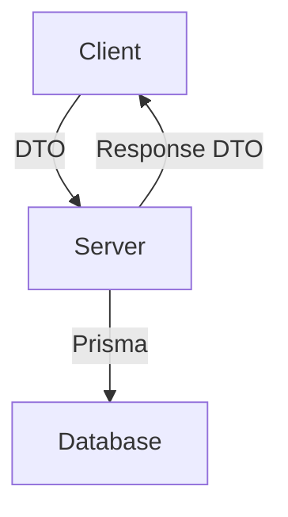

## Architektura modułu `user/dashboard`

### Kierunki komunikacji i podział typów

### Podział odpowiedzialności

| Kierunek        | Typ danych            | Lokalizacja                                           | Cel                          |
| --------------- | --------------------- | ----------------------------------------------------- | ---------------------------- |
| Client ➝ Server | DTO (z walidacją)     | `apps/server/modules/user/dashboard/dashboard.dto.ts` | Walidacja danych wejściowych |
| Server ➝ Client | Output DTO / Response | `packages/types/src/modules/user/dashboard/*.ts`      | Typowanie danych wyjściowych |
| Server ↔ DB     | Model domenowy (ORM)  | `@zbir/database` (Prisma)                             | Obsługa danych w bazie       |

### Zasady i dobre praktyki

* **Input DTO (`*.dto.ts`)**: Tylko do walidacji żądań (`class-validator`), nie eksportowane poza backend.
* **Output DTO (w `@zbir/types`)**: Reprezentują jawne dane wysyłane do klienta (np. `UserAccountData`).
* **Prisma Client (`@zbir/database`)**: Używany tylko po stronie backendu – brak dostępu z klienta.
* **Brak zależności cyklicznych**: `@zbir/types` nie importuje `@zbir/database`.

### Bezpieczeństwo i skalowalność

* Dane wysyłane do klienta są jawnie określone i ograniczone (`Pick`, `Omit`, dedykowane typy)
* Brak wycieku typów domenowych (`password`, `isBlocked`, `canUserEdit`, itd.)
* Wysoka zgodność z zasadami Clean Architecture, SRP i Security by Design
* Łatwa rozbudowa o typy `AdminUserDto`, `MinimalUserDto`, itp.

### Moduł `admin/session` – Dokumentacja techniczna

#### Cel modułu

Moduł `admin/session` zapewnia funkcjonalność administracyjną do zarządzania sesjami użytkowników w systemie. Umożliwia przegląd, filtrowanie, sortowanie oraz usuwanie sesji (indywidualnych i zbiorczych), zarówno aktywnych, jak i wygasłych.

---

### Struktura funkcjonalna

#### 1. Typy wspólne `@zbir/types`

* `GroupedUserSession`: reprezentuje agregację sesji użytkownika (łącznie z liczbą sesji i aktywnych sesji)
* `UserSession`: reprezentuje pojedynczą sesję z podstawowymi danymi i statusem aktywności
* `GroupedUserSessionSortBy` i `UserSessionSortBy`: enumeracje zawierające dozwolone pola sortowania
* `PaginationQuery<T>`: generyczny typ zapytania paginacyjnego z opcjonalnym `sortBy` i `sortDirection`
* `PaginationResponse<T>`: typ odpowiedzi dla paginacji
* `SortDirection`: enum `asc` lub `desc`

---

#### 2. DTO

* `PaginationQueryDto`: wspólna klasa z dekoratorami do walidacji parametrów paginacyjnych (`page`, `limit`, `search`, `sortDirection`)
* `GroupedSessionQueryDto`: rozszerzenie DTO z `sortBy` opartym na `GroupedUserSessionSortBy`
* `UserSessionQueryDto`: rozszerzenie DTO z `sortBy` opartym na `UserSessionSortBy`

---

#### 3. Endpointy HTTP (`SessionController`)

* `GET /admin/session`: zwraca listę użytkowników z agregacją sesji (grupowane)
* `GET /admin/session/:userId`: zwraca listę sesji danego użytkownika
* `DELETE /admin/session/:id`: usuwa pojedynczą sesję po ID
* `DELETE /admin/session/user/:userId`: usuwa wszystkie sesje danego użytkownika
* `DELETE /admin/session/user/:userId/inactive`: usuwa tylko wygasłe sesje danego użytkownika
* `DELETE /admin/session/inactive/all`: usuwa wszystkie wygasłe sesje w systemie

Wszystkie endpointy zabezpieczone guardami `JwtAuthGuard` oraz `RolesGuard`, z dostępem tylko dla ról `ADMIN` i `ROOT`.

---

#### 4. Logika serwisu (`SessionService`)

* `getGroupedUsersSessions(...)`:

  * pobiera listę użytkowników posiadających sesje
  * oblicza liczby sesji i aktywnych sesji
  * wspiera sortowanie po `email`, `role`, `sessionCount`, `activeSessionCount` (dwa ostatnie sortowane ręcznie)
* `getUserSessions(...)`:

  * pobiera sesje pojedynczego użytkownika z opcjonalnym filtrowaniem i sortowaniem
  * dodaje pole `isActive` na podstawie `expires`
* `deleteSession(...)`: usuwa sesję po ID
* `deleteUserSessions(...)`: usuwa wszystkie sesje użytkownika
* `deleteInactiveUserSessions(...)`: usuwa tylko wygasłe sesje użytkownika
* `deleteAllInactiveSessions(...)`: usuwa wszystkie wygasłe sesje w systemie

---

### Wartości domyślne

* `page = 1`, `limit = 25` (z możliwością zmiany przez query string)
* sortowanie domyślne po `createdAt` lub `email` w kierunku `desc`
* brak wyników przy `page` przekraczającym zakres (do rozważenia: auto-przycinanie do maxPage)

### Podsumowanie wykonanych prac – **Moduł Admin Sesje** (Frontend + Backend)

#### **1. Widok zbiorczy sesji (`/admin/sessions`):**

* Implementacja **pełnej tabeli** z sesjami użytkowników (agregacja po userze):

  * Dane: `email`, `rola`, liczba `sesji` i `aktywneSesje`.
  * Obsługa sortowania po `email`, `role`, `sessionCount`, `activeSessionCount`.
  * Wyszukiwanie po `email`.
  * Paginacja z limitem (limit zdefiniowany w `@zbir/types`).
* Akcje:

  * Podgląd szczegółów sesji (`router.push` do `/admin/session/[userId]` z przekazaniem `email` w query).
  * Usunięcie wszystkich sesji użytkownika.
  * Usunięcie tylko nieaktywnych sesji użytkownika.
  * Usunięcie **wszystkich** nieaktywnych sesji (globalnie).

#### **2. Widok szczegółowy sesji (`/admin/session/[userId]`):**

* Pobieranie sesji dla danego `userId` z backendu (z paginacją, sortowaniem i filtrowaniem).
* Wyświetlanie tabeli z sesjami (`ip`, `deviceInfo`, `createdAt`, `expires`).
* Przycisk `Usuń` do usuwania pojedynczej sesji.
* Nagłówek zawierający:

  * Przycisk „Wróć do listy sesji”.
  * E-mail użytkownika pobrany z query param (`?email=...`).
  * Pasek wyszukiwania po `ip` / `deviceInfo` + `Reset`.

#### **3. Backend API (NestJS):**

* Endpointy:

  * `GET /admin/session/grouped` – pobieranie agregowanych danych użytkowników z sesjami.
  * `DELETE /admin/session/user/:userId` – usuwa wszystkie sesje użytkownika.
  * `DELETE /admin/session/user/inactive/:userId` – usuwa nieaktywne sesje użytkownika.
  * `DELETE /admin/session/inactive` – usuwa wszystkie nieaktywne sesje globalnie.
  * `GET /admin/session/user/:userId/list` – pobiera sesje konkretnego użytkownika.
  * `DELETE /admin/session/:id` – usuwa pojedynczą sesję.
* Obsługa sortowania przez DB lub sortowania in-memory przy polach wirtualnych (`sessionCount`, `activeSessionCount`).
* Bezpieczne paginowanie, obsługa błędów.

#### **4. API Proxy (Next.js):**

* Konfiguracja handlerów dla wszystkich endpointów w `/app/api/admin/session/...`.
* Przekazywanie cookies i danych przez `proxyHandler`.
* Obsługa `DELETE`, `GET`, `PATCH`.

#### **5. UI i UX:**

* Komponent `Paginator` z `ALLOWED_PAGINATION_LIMITS` zdefiniowanymi globalnie.
* Komponent `Table` z obsługą:

  * sortowania (`onSortChange`),
  * paginacji,
  * akcji (buttony),
  * numeracji wierszy.
* Dynamiczne przekazywanie `email` w URL (nie wpływa na backend).
* Obsługa błędów, loadingu, pustych wyników, confirm dialogów.